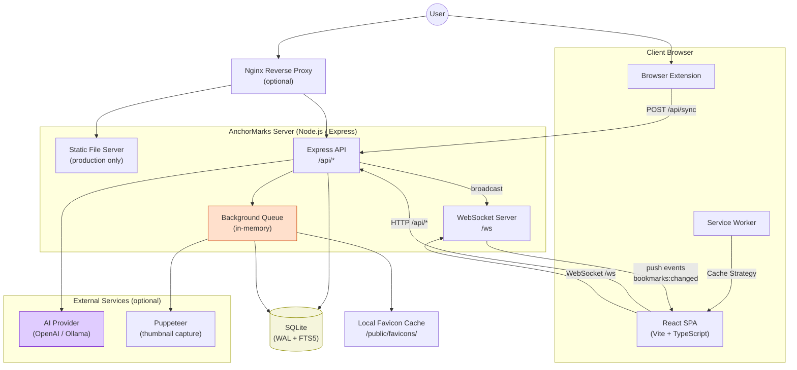
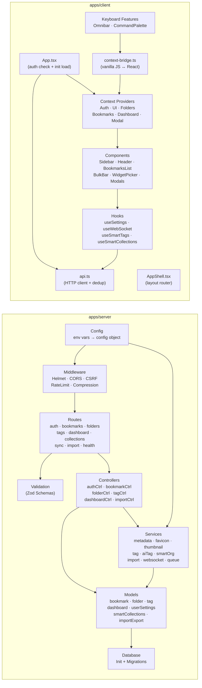
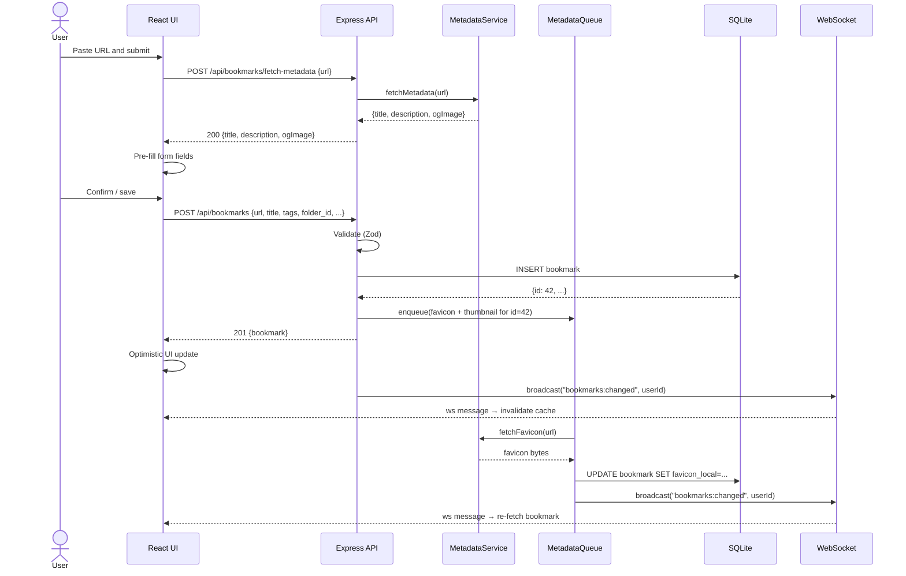
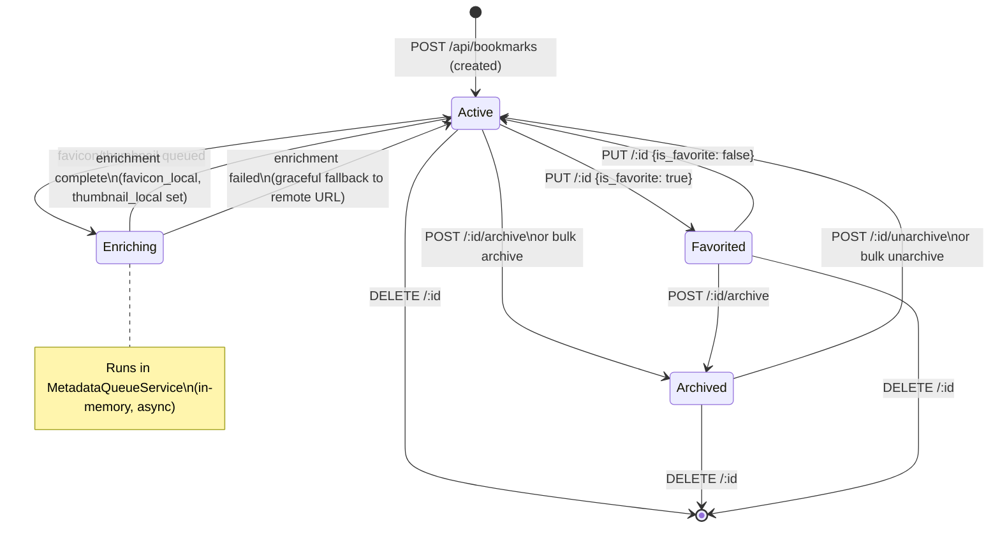
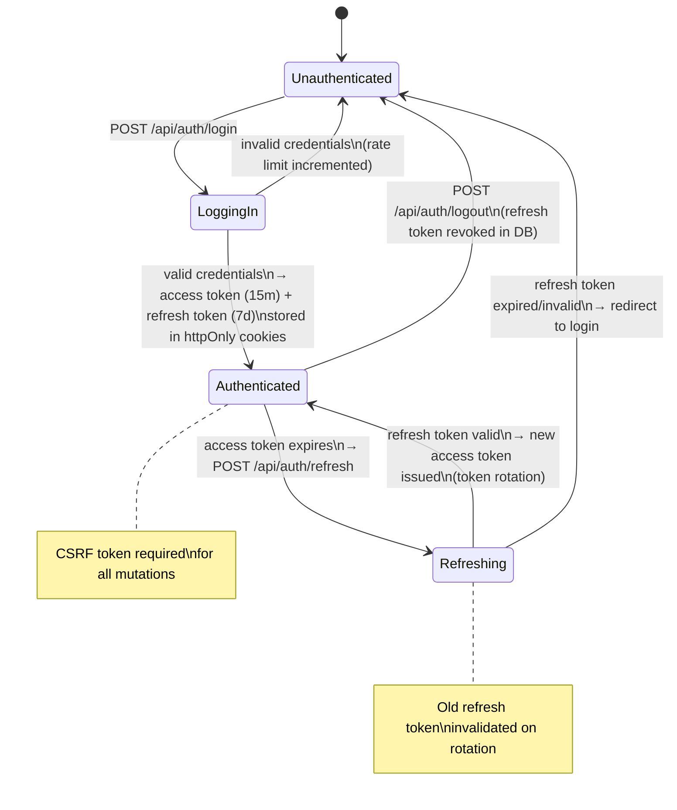
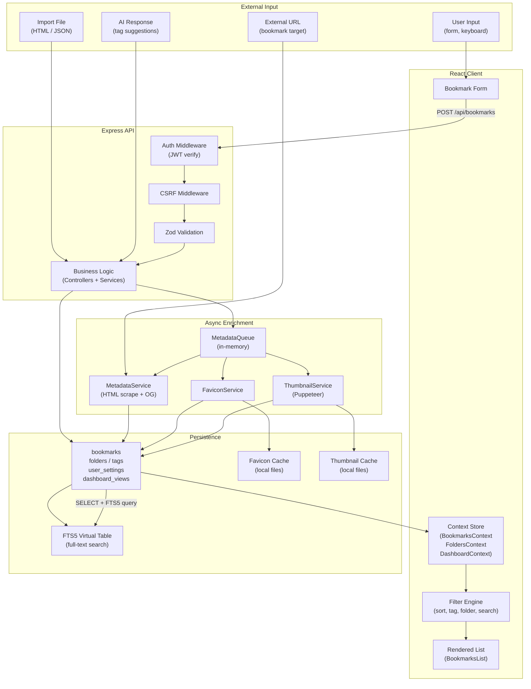

# AnchorMarks — Architectural Review

---

## 1. Executive Summary

### What the App Does

AnchorMarks is a self-hosted bookmark manager. Users register an account, save URLs with auto-fetched metadata (title, description, OG image, favicon), organize them into nested folders and tags, and search them via full-text or fuzzy search. A configurable dashboard, smart collections (saved filter views), tag analytics, and optional AI-powered tag suggestions round out the feature set. A browser extension and a Flow Launcher plugin provide external entry points. Real-time updates across browser tabs are delivered via WebSocket.

### Key Modules and Responsibilities

| Module | Location | Responsibility |
|---|---|---|
| Express API server | `apps/server/` | All data mutations, auth, business logic |
| SQLite + WAL | `apps/server/models/` | Persistent storage; FTS5 for full-text search |
| React SPA | `apps/client/src/` | UI, context state, API calls |
| Auth subsystem | `server/middleware/`, `controllers/authController` | JWT access/refresh tokens, CSRF, rate limiting |
| Metadata pipeline | `server/services/metadata*`, `favicon*`, `thumbnail*` | Async URL enrichment after save |
| WebSocket service | `server/services/websocketService.js` | Push invalidation signals to all tabs |
| AI tag service | `server/services/aiTagService.js` | Optional OpenAI/Ollama tag suggestions |
| Browser extension | `tooling/extension/` | In-browser quick-save |

### Major Strengths

- **Security posture is deliberate.** SSRF guards, CSRF tokens, httpOnly cookies, Helmet CSP, Zod input validation, per-IP rate limiting, and scoped API keys are all in place and tested.
- **SQLite WAL + FTS5 is the right tradeoff** for a single-user self-hosted tool: zero infrastructure, fast reads, full-text search out of the box.
- **Test coverage breadth.** 30+ backend test files covering auth, tenant isolation, migrations, security bypasses, and API contracts. Frontend uses React Testing Library + Playwright E2E.
- **Async enrichment pipeline.** Metadata, favicons, and thumbnails are queued and processed after the bookmark is saved, so the create operation is fast.
- **Clean separation of concerns.** Controllers are thin; services own business logic; models own queries; validation is centralized.

### Major Risks

- **No persistent job queue.** The `metadataQueueService` is entirely in-memory. A server restart silently drops all pending enrichment jobs.
- **Server is plain JavaScript; client is TypeScript.** There is no shared type contract. If an API response shape changes, the TypeScript client compiles fine but breaks at runtime.
- **Single file SQLite without automated backup.** The deployment docs mention backup but provide no mechanism. One corrupted write ends the database.
- **Puppeteer is bundled.** `puppeteer@24` ships its own Chromium (~300 MB). This is optional but enabled in the default image, bloating the Docker layer.
- **WebSocket auth window.** The WebSocket handshake reads the JWT cookie, but there is no per-message re-authentication; a stolen cookie grants durable WS access beyond the 15-minute access token window until the connection drops.

---

## 2. Code Review

### Architecture and Design Patterns

**Pattern: Controller → Service → Model (CSM)**
The server follows a clean three-layer pattern. Controllers parse HTTP, delegate to services (business logic), which call model functions (raw SQL). This is correct and consistent.

**Pattern: React Context as global state**
The client uses eight context providers stacked in `AppProviders`. This is a reasonable choice for a medium-sized app but begins to show strain — `BookmarksProvider` fetches bookmarks, applies filters, and manages pagination all in one context, making it hard to test or optimize slices independently.

**Pattern: Request deduplication in the API client**
`api.ts` caches in-flight GET requests by URL, preventing duplicate concurrent calls. This is a thoughtful optimization that is easy to miss and worth preserving.

**Pattern: FTS5 with trigger sync**
Full-text search is maintained via `INSERT`/`UPDATE`/`DELETE` triggers on the `bookmarks` table that sync to `bookmarks_fts`. This is the correct SQLite pattern and avoids a separate search index process.

---

### Code Quality Issues

**1. Mixed language in the monorepo (JS server, TS client)**
The server (`apps/server/`) is plain JavaScript with no type checking. The client is TypeScript. There is no shared schema or generated types. Any API contract drift is caught only at runtime.

*Recommendation:* Add a `apps/shared/` package with Zod schemas that both the server (already uses Zod) and client import. The Zod `.infer<>` utility produces TypeScript types from schemas with no extra work. This closes the contract gap without a full rewrite.

**2. `BookmarksProvider` is over-loaded**
`apps/client/src/contexts/BookmarksContext.tsx` owns: fetch logic, filter state, pagination state, bulk selection, and WebSocket-triggered invalidation. A change to filter logic requires understanding all six concerns simultaneously.

*Recommendation:* Extract `useBookmarkFilters` and `useBulkSelection` into standalone hooks. The context becomes a data provider; hooks compose on top.

**3. Inline SQL strings in model files**
SQL is written as raw template literals scattered across `bookmark.js`, `folder.js`, `tag.js`, etc. There is no query builder, no parameterization helper, and no central place to audit queries.

*Recommendation:* No ORM is needed, but extracting SQL into named constants at the top of each model file (e.g., `const FIND_BY_USER = 'SELECT ...'`) makes queries grep-able and auditable.

**4. No persistent job queue**
`metadataQueueService.js` uses an in-memory queue processed with `setImmediate`/`setTimeout`. Server restart = silent data loss for all pending favicon/thumbnail jobs.

*Recommendation:* Use [better-queue](https://www.npmjs.com/package/better-queue) with SQLite persistence, or simply write pending jobs to a `background_jobs` table on enqueue and mark them done on completion. The existing SQLite dependency makes this zero-cost infrastructure-wise.

**5. `config/index.js` auto-generates `COOKIE_PREFIX` from `JWT_SECRET`**
If `JWT_SECRET` changes (e.g., a credential rotation), `COOKIE_PREFIX` also changes, silently invalidating all existing sessions with a confusing UX failure rather than a clean logout prompt.

*Recommendation:* Make `COOKIE_PREFIX` an independent required environment variable in production. Document that it must not change between deployments.

---

### Anti-Patterns and Technical Debt

**A. `context-bridge.ts` — imperative pub/sub between vanilla JS and React**
The bridge exists because some features (keyboard shortcuts, omnibar) are implemented as vanilla JS classes rather than React components, requiring a global event bus to trigger React state changes.

*Risk:* This creates invisible coupling. Any rename of a context method requires updating both the context and the bridge without compiler help.

*Recommendation:* Either migrate the keyboard/omnibar features to React hooks (preferred), or document the bridge exhaustively and add integration tests that cover each bridge channel.

**B. `useSmartTags`, `useSmartCollections`, `useSmartInsights` are duplicated in shape**
All three hooks follow the same pattern: fetch on mount, return `{ data, loading, error }`. They could be collapsed into a single `useSmartFeature(endpoint)` generic hook, reducing ~150 lines to ~30.

**C. Dashboard widget config stored as JSON columns**
`dashboard_views.config` and `user_settings.settings_json` are JSON blobs. Schema changes to widget config are invisible to SQLite and require careful versioning.

*Recommendation:* Add a `config_version` integer column to `dashboard_views`. On read, migrate old config shapes in the model layer before returning to the client.

**D. Puppeteer in the main process**
`thumbnailService.js` launches Puppeteer in the same Node.js process as the API server. A Puppeteer crash (which is common with complex pages) can take down the API.

*Recommendation:* Spawn Puppeteer in a child process or a dedicated worker. Use `child_process.fork` with a message-based interface. The thumbnail service already has a `THUMBNAIL_ENABLED` flag that makes this easy to isolate.

---

### Security Concerns

| Issue | Severity | Details |
|---|---|---|
| WebSocket auth drift | Medium | WS connection authenticated at handshake; access token expiry (15m) is not enforced per-message. A session with a revoked/expired token stays connected until the socket drops. |
| `COOKIE_PREFIX` tied to `JWT_SECRET` | Low | Credential rotation causes silent session invalidation with no user-facing explanation. |
| Audit log is opt-in | Low | `SECURITY_LOG_FILE` is not set by default. Security-relevant events (failed logins, password changes) are silently dropped in the default configuration. |
| No Content-Length limit on import | Low | `/api/import` accepts multipart upload with no documented file size cap, which could exhaust server memory on a large HTML export. |

---

### Performance Concerns

| Issue | Notes |
|---|---|
| `bookmark_count` is computed per-query | Folder listing joins and counts bookmark rows each request. Fine at thousands of bookmarks; needs a materialized count column at millions. |
| FTS5 rebuild on bulk import | Triggers fire row-by-row during import. A 10k-bookmark import fires 10k FTS insert triggers synchronously. Consider disabling triggers, bulk inserting, then rebuilding FTS in one pass. |
| No HTTP-level cache headers on static favicon files | Favicons served from `/apps/server/public/` are re-fetched by the browser on every navigation without `Cache-Control: max-age` headers. |

---

### Specific, Actionable Recommendations (Priority Order)

1. **Add a `background_jobs` SQLite table** to make the metadata queue crash-safe. Estimated effort: 1–2 days.
2. **Create a `apps/shared` Zod schema package** and import types in both server and client. Estimated effort: 2–3 days.
3. **Move Puppeteer to a child process.** Add a `SIGTERM` handler to the worker. Estimated effort: 1 day.
4. **Add `Cache-Control` headers for favicon static files.** Estimated effort: 30 minutes.
5. **Enforce WS token expiry** by sending a `token:expired` message and closing the socket when the access token age exceeds `JWT_ACCESS_EXPIRY`. Estimated effort: 1 day.
6. **Make `COOKIE_PREFIX` independent** of `JWT_SECRET` and document in `.env.example`. Estimated effort: 2 hours.
7. **Add `Content-Length` limit to import route** using Express's `express.json({ limit: '10mb' })` and a multer file size cap. Estimated effort: 1 hour.
8. **Enable security audit logging by default** (write to `./logs/security.log`), with an opt-out env var. Estimated effort: 1 hour.

---

## 3. Diagrams

### System Architecture Diagram

---

### Module / Component Diagram

---

### Sequence Diagram — Save a Bookmark

---

### State Machine — Bookmark Lifecycle

---

### State Machine — Authentication Flow

---

### Data Flow Diagram

---

## 4. Narrative Walkthrough

### System Architecture — The Big Picture

AnchorMarks runs as a single Node.js process. In development, a Vite dev server (port 5173) proxies all `/api/*` requests to the Express server (port 3000). In production, Express serves the pre-built Vite output from `apps/client/dist` and handles all API traffic itself, optionally behind an Nginx reverse proxy.

A WebSocket server shares the same HTTP server instance. It is mounted at `/ws` and handles real-time push notifications — when any tab creates or updates a bookmark, the server broadcasts an invalidation signal to all other open tabs belonging to that user, which triggers a silent re-fetch.

The browser extension communicates through a dedicated `/api/sync` route, using the same JWT cookie auth as the SPA. The Flow Launcher plugin is a separate Windows desktop integration.

---

### Module Diagram — How the Code is Organized

On the **server**, every incoming request passes through a chain of middleware (Helmet security headers → CORS → CSRF check → rate limiter) before reaching a route. Routes delegate immediately to controllers, which are thin — they validate inputs with Zod schemas, call one or more service functions, and return the result. Services own the business logic (e.g., "when creating a bookmark, also ensure the tags exist and link them"). Models contain raw SQL queries against the SQLite database.

On the **client**, `App.tsx` bootstraps the session (checks auth, loads initial data), then renders `AppShell.tsx` which chooses between the login screen and the main layout. The main layout is wrapped in eight React context providers that act as the client-side state store. Components read from contexts via hooks; they do not talk to the API directly — that goes through the API service layer in `api.ts`.

There is a `context-bridge.ts` module that acts as a pub/sub bus between the vanilla-JS keyboard/omnibar features and the React context tree. This is the highest-coupling point in the codebase and the most fragile.

---

### Sequence Diagram — Saving a Bookmark

When a user pastes a URL into the add-bookmark form, the UI fires an immediate pre-fetch request (`POST /api/bookmarks/fetch-metadata`) which scrapes the target URL's HTML for title, description, and Open Graph image, then pre-fills the form. This is a synchronous operation on the fast path so the user sees useful defaults.

When the user confirms and saves, the bookmark row is inserted into SQLite immediately and a `201 Created` response is returned. The favicon and thumbnail enrichment are placed on an async in-memory queue. The API then broadcasts a `bookmarks:changed` WebSocket event, which causes all open tabs to refresh their bookmark list.

The queue processes enrichment jobs in the background: fetching the favicon, storing it as a local file, updating the bookmark row, and broadcasting another WebSocket event so the UI updates the favicon display without user action.

---

### Bookmark State Machine — Lifecycle

A newly created bookmark is in the **Active** state. It immediately enters **Enriching** as the metadata queue picks it up. Enrichment either completes (setting `favicon_local` and `thumbnail_local`) or fails gracefully (falling back to the original remote URL). Either way it returns to **Active**.

From **Active**, a bookmark can be favorited (the `is_favorite` flag is set) or archived (moved to the archive view, hidden from main lists). Archiving and favoriting are independent; a favorited bookmark can be archived. Both states revert with their inverse operations. Any bookmark in any state can be permanently deleted.

---

### Auth State Machine — Session Management

A visitor starts **Unauthenticated**. On successful login, the server issues two httpOnly cookies: a short-lived access token (15 minutes by default) and a long-lived refresh token (7 days). The client is now **Authenticated**.

When the access token expires, the client's API layer automatically fires `POST /api/auth/refresh`. If the refresh token is still valid, a new access token is issued and the old refresh token is rotated (the old one is deleted from the database and a new one is written). This is token rotation — it provides a degree of protection against refresh token theft because a stolen token can only be used once.

If the refresh token itself has expired or been revoked (e.g., by logout), the user is returned to **Unauthenticated** and redirected to the login screen. All mutations also require a CSRF token, enforced via middleware.

---

### Data Flow Diagram — From Input to Screen

Data enters the system from four sources: user form input, the external URL being bookmarked (scraped by MetadataService), import files, and optional AI tag responses. All paths pass through auth middleware, CSRF validation, and Zod schema validation before reaching business logic.

Business logic writes to the main SQLite tables. SQLite triggers automatically keep the FTS5 virtual table in sync with any changes to bookmark text. The async enrichment queue writes favicon and thumbnail files to the local filesystem and updates the bookmark rows.

On the read path, the React context providers call the API, receive JSON, and store it in React state. The filter engine (inside `BookmarksContext`) applies the current filter state (sort, tag filter, folder filter, full-text search) client-side for fast interaction, dispatching a new API call only when the server-side data needs to change. The rendered bookmark list is a pure function of what the context holds.

---

*Review complete. The codebase is structurally sound and security-conscious. The highest-priority improvements are making the metadata queue crash-safe (persistent job table), sharing Zod types between server and client, and isolating Puppeteer from the main API process.*
